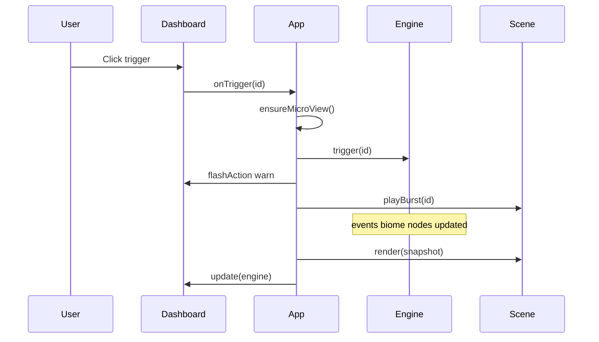

# System Overview

Application architecture for Bio-Dynamics: modules, runtime loop, and dependencies.

---

## Tech stack

| Layer | Technology | Version |
| --- | --- | --- |
| Language | TypeScript (strict) | ~5.6.3 |
| Bundler | Vite | ^6.0.3 |
| 3D | Three.js + OrbitControls | ^0.170.0 |
| Simulation | Plain TypeScript | — |
| UI | Vanilla HTML/CSS | — |
| Fonts | IBM Plex Sans / Mono | Google Fonts |
| Build target | ES2022 | — |

Runtime dependency: `three` only.

---

## Entry chain

```text
index.html
  └── <script type="module" src="/src/main.ts">
        ├── import './style.css'
        └── new App(#app)
```

[`src/main.ts`](../src/main.ts) mounts the app on `#app`.

---

## Module responsibilities

| Module | Path | Role |
| --- | --- | --- |
| **App** | `src/app/App.ts` | Top-level orchestrator; wires engine, dashboard, scene; main loop |
| **SimEngine** | `src/sim/engine.ts` | Deterministic microbiome simulation |
| **Types** | `src/sim/types.ts` | MicrobeNode, BiomeState, SimSnapshot |
| **Regions** | `src/data/regions.ts` | Seven regions, baselines, triggers, inoculations |
| **Env vars** | `src/data/envVars.ts` | Slider definitions and region control subsets |
| **Presets** | `src/data/presets.ts` | Scenarios, URL parsing |
| **Articles** | `src/data/articles.ts` | Blog URLs |
| **Dashboard** | `src/ui/Dashboard.ts` | Full-screen lab UI overlay |
| **SceneManager** | `src/scene/SceneManager.ts` | Three.js scene orchestration |
| **BodyMesh** | `src/scene/BodyMesh.ts` | Low-poly body + hotspots |
| **CameraRig** | `src/scene/CameraRig.ts` | Macro/micro camera transitions |
| **TissueLayer** | `src/scene/TissueLayer.ts` | Microbe placement + epithelium bridge |
| **Epithelium3D** | `src/scene/epithelium/Epithelium3D.ts` | Tissue model manager |
| **tissueModels** | `src/scene/epithelium/tissueModels.ts` | Procedural cross-section builders |
| **MicrobeMeshes** | `src/scene/microbes/MicrobeMeshes.ts` | Instanced microbe rendering |
| **EffectBurst** | `src/scene/EffectBurst.ts` | Action visual feedback |
| **tissueCallouts** | `src/scene/tissueCallouts.ts` | 3D→2D anatomical labels |

---

## Directory structure

```text
src/
  main.ts
  style.css
  vite-env.d.ts
  app/
    App.ts
  sim/
    engine.ts
    types.ts
  data/
    regions.ts
    envVars.ts
    presets.ts
    articles.ts
  ui/
    Dashboard.ts
  scene/
    SceneManager.ts
    BodyMesh.ts
    CameraRig.ts
    TissueLayer.ts
    EffectBurst.ts
    tissueCallouts.ts
    microbes/
      MicrobeMeshes.ts
    epithelium/
      index.ts
      types.ts
      tissuePalette.ts
      tissueModels.ts
      Epithelium3D.ts
      LumenChamber.ts
```

---

## Runtime loop

[`App.loop()`](../src/app/App.ts):

```text
requestAnimationFrame
  → dt = min((now - lastTime) / 1000, 0.1)
  → snap = engine.step(dt)
  → scene.render(snap)
  → dashboard.updateHotspotLabels(projections)
  → dashboard.updateTissueCallouts(projections)
  → dashboard.update(engine, fps)
  → requestAnimationFrame
```

Simulation and rendering are **decoupled**: engine produces `SimSnapshot`; scene and dashboard consume it independently.

---

## Initialization sequence

1. `parseUrlState()` — read `?preset=`, `?region=`, `?context=`
2. `new SimEngine(preset, region)` — seed region baseline
3. `engine.setPreset(preset, presetDef.env)` — apply preset env
4. `new Dashboard(mount, callbacks, context)` — build UI
5. `dashboard.setPreset()`, `setRegionActions()`, `syncEnvSliders()`
6. `new SceneManager(canvas, REGIONS, onRegionSelect)`
7. If region active: `selectRegion(region)` on next frame
8. Start `loop()`

---

## User action flow



Region selection follows: `onRegionSelect` → `engine.setRegion` → dashboard sync → `scene.selectRegion`.

Preset change resets simulation and returns to body map before re-selecting default region.

---

## URL state

[`parseUrlState()`](../src/data/presets.ts):

| Param | Effect |
| --- | --- |
| `preset` | Initial scenario (default `allergy`) |
| `region` | Initial region (default preset's `defaultRegion`) |
| `context` | `lifestage` switches allergy scenario text + article |

Invalid preset falls back to `allergy`.

---

## Build configuration

[`vite.config.ts`](../vite.config.ts):

- `base = process.env.PLAYGROUND_BASE ?? '/'`
- Build target ES2022
- Output: `dist/`

Deployed under `/labs/microbiome-sandbox/` via playground orchestrator.

---

## Related docs

- [Visualization](visualization.md)
- [UI dashboard](ui-dashboard.md)
- [Setup and build](../development/setup-and-build.md)
- [Data model](../simulation/data-model.md)
