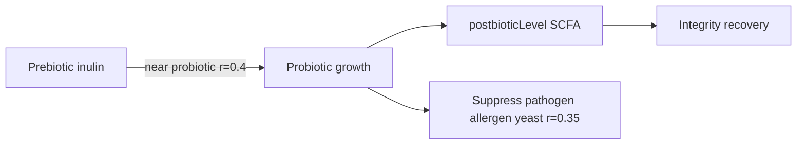

# Biotics

Microbe taxonomy, strain catalog, and the prebiotic → probiotic → postbiotic lifecycle modeled in Bio-Dynamics.

Sources: [`src/sim/types.ts`](../src/sim/types.ts), [`src/sim/engine.ts`](../src/sim/engine.ts), [`src/data/regions.ts`](../src/data/regions.ts)

---

## Microbe taxonomy

```typescript
type MicrobeType =
  | 'probiotic'
  | 'commensal'
  | 'pathogen'
  | 'allergen'
  | 'yeast'
  | 'prebiotic'
  | 'postbiotic';
```

| Type | Representation | Role |
| --- | --- | --- |
| `probiotic` | Individual `MicrobeNode` | Beneficial bacteria; grow in optimal pH bands; suppress competitors |
| `commensal` | Individual `MicrobeNode` | Neutral residents; support barrier; harmed by antibiotics/allergens |
| `pathogen` | Individual `MicrobeNode` | Harmful bacteria; favor alkaline pH and sugar |
| `yeast` | Individual `MicrobeNode` | Fungal pathogens (C. albicans, Malassezia); counted in pathogen stat |
| `allergen` | Individual `MicrobeNode` | Pollen, dust, irritant particles; spawn from above |
| `prebiotic` | Individual `MicrobeNode` | Substrate (inulin); converts to postbiotic near probiotics |
| `postbiotic` | Scalar `postbioticLevel` | SCFA metabolites; not individual nodes |

Pathogen count in the UI includes both `pathogen` and `yeast` node types.

---

## Probiotic strains

| Strain | Action ID | Available regions | Primary effects |
| --- | --- | --- | --- |
| L. rhamnosus | `lrham` | ear, scalp, nose, vaginal (+ all via strain panel) | Spawn 16; inflammation −0.18; integrity +0.1 |
| L. acidophilus | `lacid` | oral, skin, vaginal (+ strain panel) | Spawn 18; pH −0.5; biofilm −0.2 |
| L. casei | `lcasei` | gut, oral (+ strain panel) | Spawn 14; inflammation −0.12; integrity +0.08 |
| L. paracasei | `lparacasei` | gut, oral, nose (+ strain panel) | Spawn 14; inflammation −0.14; postbiotic +0.03 |
| L. salivarius | `lsaliv` | oral (+ strain panel) | Spawn 18; pH −0.2; biofilm −0.15 |
| L. reuteri | `lreuteri` | gut, oral, vaginal (+ strain panel) | Spawn 12; inflammation −0.14; pH −0.15 |
| L. gasseri | `lgasseri` | vaginal, oral, gut (+ strain panel) | Spawn 14; inflammation −0.16; pH −0.12 |
| L. fermentum | `lferment` | gut, oral (+ strain panel) | Spawn 12; pH −0.18; postbiotic +0.05 |
| B. lactis | `blactis` | gut (+ strain panel) | Spawn 14; commensal +0.15; postbiotic +0.04 |
| B. longum | `blongum` | gut (+ strain panel) | Spawn 12; commensal +0.12; postbiotic +0.05 |
| B. bifidum | `bbifidum` | gut (+ strain panel) | Spawn 12; commensal +0.14; postbiotic +0.04 |
| B. breve | `bbreve` | gut (+ strain panel) | Spawn 13; commensal +0.16; postbiotic +0.05 |
| B. infantis | `binf` | nose, gut (+ strain panel) | Spawn 14; commensal +0.2; integrity +0.08 |
| L. plantarum | `lplant` | gut (+ strain panel) | Spawn 16; inflammation −0.18; integrity +0.1 |
| L. bulgaricus | `lbulgaricus` | strain panel (all regions) | Spawn 10; pH −0.25; biofilm −0.1 |
| S. thermophilus | `sthermo` | strain panel (all regions) | Spawn 10; pH −0.15 |
| S. boulardii | `sboul` | oral (+ strain panel) | Spawn 14; yeast −0.25; inflammation −0.12 |
| S. salivarius K12 | `ssaliv_k12` | oral, nose, ear (+ strain panel) | Spawn 16; biofilm −0.18; oral BLIS niche |
| S. salivarius M18 | `ssaliv_m18` | oral, nose, ear (+ strain panel) | Spawn 16; biofilm −0.22; dental/gum niche |

Note: **L. salivarius** (`lsaliv`) and **S. salivarius K12/M18** are different organisms — the oral lozenge product uses *Streptococcus* salivarius strains.

**Typical 8-strain synbiotic capsule:** acidophilus, casei, rhamnosus, salivarius, reuteri, lactis, longum, bifidum plus FOS — see [Multi-strain synbiotic capsule](products.md).

Catalog source: [`src/data/strains.ts`](../../src/data/strains.ts)

### Growth preferences

Probiotic growth rate depends on pH and region (`probioticGrowthRate`):

- **Oral / vaginal:** optimal pH 3.8–5.2 (rate 0.004/tick); acceptable 3.5–6.0 (0.002)
- **Other regions:** optimal pH 5.5–6.8 (0.004); acceptable 5.0–7.2 (0.002)

Additional region modifiers in [Simulation dynamics](../simulation/dynamics.md).

---

## Prebiotics

| Substrate | Action ID | Regions | Effect |
| --- | --- | --- | --- |
| Inulin | `inulin` / legacy `prebiotic` | gut, all (panel) | Spawn 20 prebiotic nodes |
| FOS | `fos` / legacy `prebiotic_fos` | gut, all (panel) | Spawn 18 FOS nodes |
| GOS | `gos` | gut, all (panel) | Spawn 16 GOS nodes |
| Resistant starch | `resistant_starch` | gut, all (panel) | Spawn 22 RS nodes |
| Pectin | `pectin` | gut, oral (panel) | Spawn 18 pectin nodes |
| Beta-glucan | `beta_glucan` | gut, all (panel) | Spawn 16 beta-glucan nodes |

**Gut baseline:** 8 inulin prebiotic nodes seeded at region init.

Use the **Prebiotics** tab in the Interventions catalog or gut **Suggested** chips.

Prebiotics drift in the lumen layer. When a probiotic is within **0.4** units, prebiotic vitality decreases and `postbioticLevel` increases (conversion rate 0.008/tick, halved in gut when moisture < 0.45).

---

## Postbiotics (SCFA)

Postbiotics are modeled as **`postbioticLevel`** on `BiomeState` (0–1), not as individual microbe nodes.

### Catalog (Interventions → Postbiotics tab)

Source: [`src/data/postbiotics.ts`](../../src/data/postbiotics.ts)

| Metabolite | Action ID | Preferred regions | Primary effects |
| --- | --- | --- | --- |
| SCFA mix | `scfa_mix` | gut | postbiotic +0.3, integrity +0.12, inflammation −0.15 |
| Butyrate | `butyrate` | gut | postbiotic +0.25, integrity +0.18, inflammation −0.12 |
| Propionate | `propionate` | gut | postbiotic +0.15, commensal +0.10, inflammation −0.08 |
| Acetate | `acetate` | gut, oral | postbiotic +0.12, pH −0.08, integrity +0.06 |

### Sources

1. **Direct application** — Postbiotics catalog or gut regional care `scfa` (maps to `scfa_mix`)
2. **Prebiotic conversion** — proximity-based, see Prebiotics section
3. **Probiotic strain effects** — some strains raise postbioticLevel on apply (e.g. B. longum)

### Emergent effects (continuous)

When `postbioticLevel > 0.2`:

- Integrity +0.001/tick
- Inflammation −0.0005/tick

### UI

SCFA stat row visible only when preset is `lifecycle`.

---

## Commensals

| Strain | Action ID | Regions | Effect |
| --- | --- | --- | --- |
| Generic commensal | (baseline) | all | Seeded per region baseline count |
| S. epidermidis | `sepidermidis` / regional `s_epidermidis` | skin, scalp (+ strain library) | Spawn 20 commensal; biofilm −0.15 |

Commensals grow slowly (+0.0005/tick) when pH is 5.5–7.5. Harmed by allergens, antibiotics, and alkaline stress.

---

## Pathogens

| Strain | Introduced by | Regions |
| --- | --- | --- |
| S. aureus | baseline, `alkaline`, `swim_exposure` (indirect) | ear, nose, scalp, skin |
| P. aeruginosa | `swim_exposure` | ear |
| H. influenzae | baseline | nose |
| S. mutans | `sugar_exposure` | oral |
| Gardnerella | `alkaline_flush` | vaginal |
| Enteropathogen | baseline label, `enteropathogen_bloom` | gut |

Pathogens favor alkaline pH (>7), high moisture + alkaline conditions, and elevated sugar load.

---

## Yeast

| Strain | Introduced by | Regions |
| --- | --- | --- |
| C. albicans | baseline, `alkaline`, `thrush_bloom`, `dry_mouth`, `alkaline_flush`, `glycogen_spike` | scalp, oral, skin, vaginal |
| Malassezia | `sebum_surge` | scalp |

Yeast uses pathogen growth rules with region-specific bonuses (sebum, low oral moisture, high vaginal pH, sugar load).

---

## Allergens

| Strain | Introduced by | Regions |
| --- | --- | --- |
| pollen | `allergen` | ear, nose |
| irritant | `friction_irritant` | scalp, skin |
| dust | baseline label | ear, scalp, nose |

Allergens spawn from above (y ∈ [0.55, 1.25]), fall toward epithelium, and gain vitality in dry nose/ear conditions.

---

## Non-biotic interventions

| Action ID | Label strain | Regions | Effect |
| --- | --- | --- | --- |
| `saline_mist` | saline_mist | ear, nose | moisture +0.15; inflammation −0.1; allergen adhesion −0.2 |
| `ph_serum` | ph_serum | scalp, skin, vaginal | pH −0.35; moisture +0.05 |

These do not spawn microbe nodes; they modify biome scalars directly.

---

## Lifecycle diagram



---

## Visual representation

Instanced mesh colors ([`src/scene/microbes/MicrobeMeshes.ts`](../src/scene/microbes/MicrobeMeshes.ts)):

| Type | Color |
| --- | --- |
| probiotic | Green palette — **distinct hue per strain** so multi-strain products read clearly |
| commensal | `#94a3b8` (slate) |
| pathogen | Red/pink palette — distinct hue per strain |
| allergen | `#fbbf24` (amber) |
| prebiotic | Lime palette — distinct hue per substrate |
| other | `#2dd4bf` (teal) |

Postbiotics affect tissue overlay emissive color in [`Epithelium3D`](../src/scene/epithelium/Epithelium3D.ts), not microbe meshes.

---

## Related docs

- [Products & foods](products.md)
- [Actions reference](actions-reference.md)
- [Simulation dynamics](../simulation/dynamics.md)
- [Body regions](regions.md)
