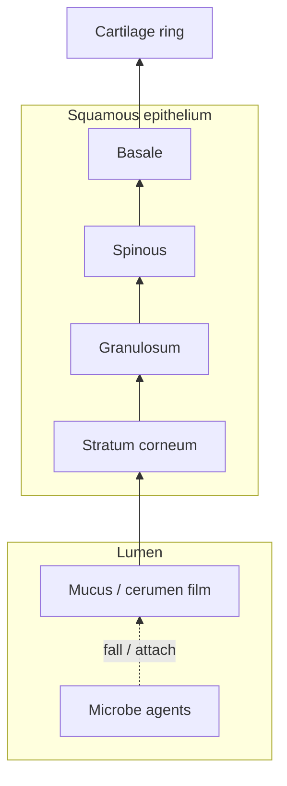
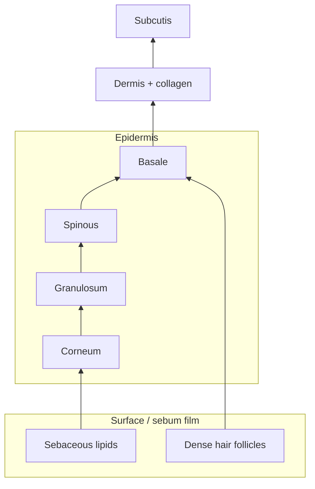
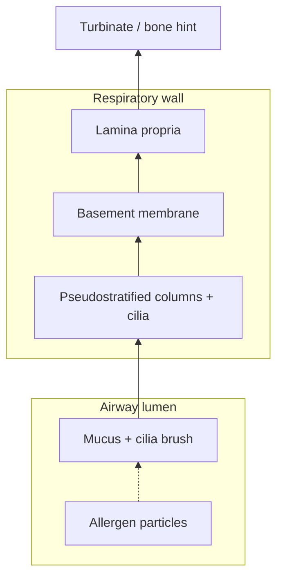
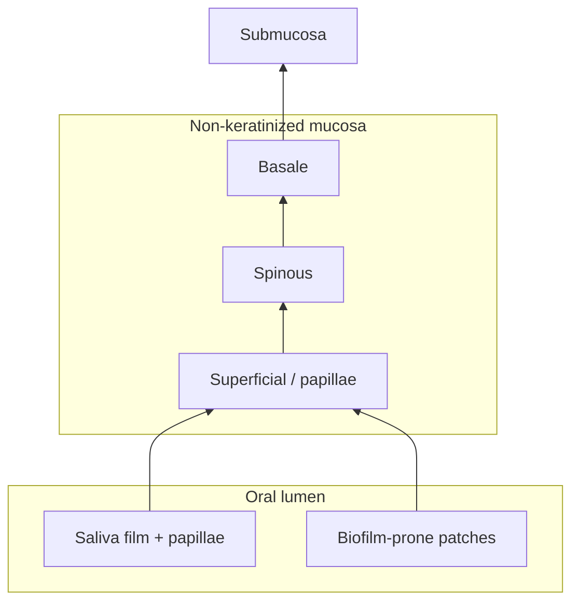
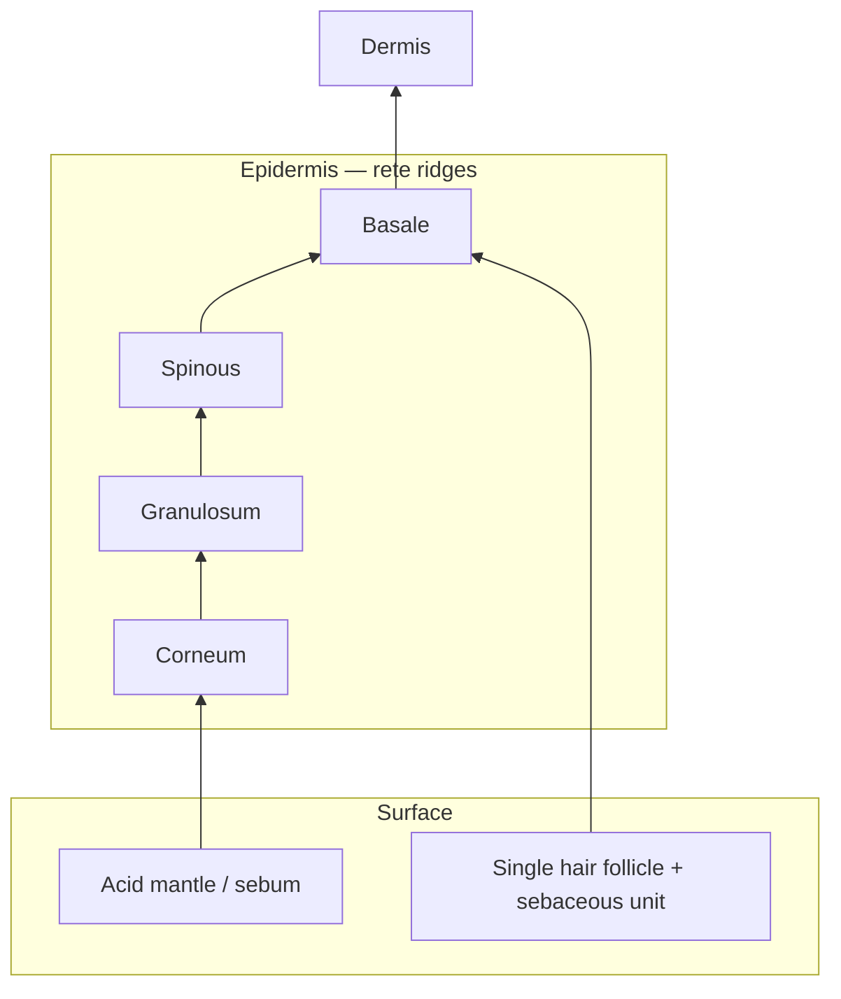
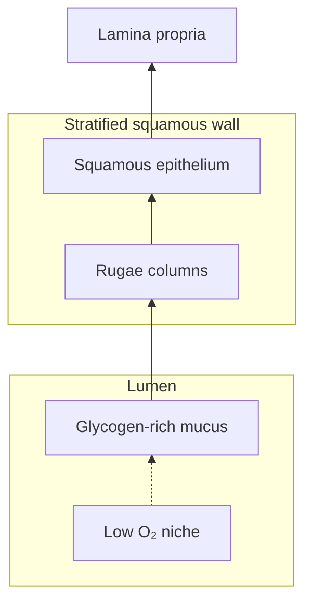
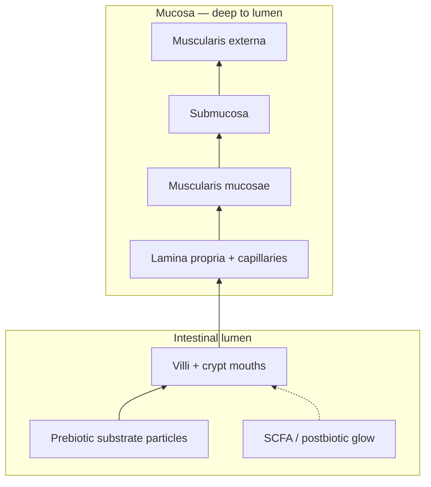

# Body Regions

Seven tissue regions are modeled, each with unique 3D cross-section geometry, baseline microbes, default environment, triggers, and inoculations.

Source: [`src/data/regions.ts`](../src/data/regions.ts)

---

## Summary table

| ID | Label | Geometry | Magnification | Commensals | Key probiotics | Key pathogens/yeast |
| --- | --- | --- | --- | --- | --- | --- |
| `ear` | Ear Canal | `ear` | 80× | 40 | L. rhamnosus (8) | S. aureus (5) |
| `scalp` | Scalp | `scalp` | 200× | 30 | L. rhamnosus (6) | C. albicans (8), S. aureus (4) |
| `nose` | Nose / Sinus | `sinus` | 400× | 50 | L. rhamnosus (8), B. infantis (4) | S. aureus (6), H. influenzae (4) |
| `oral` | Oral / Mouth | `oral` | 350× | 45 | L. salivarius (10) | C. albicans (4, yeast) |
| `skin` | Skin | `skin` | 300× | 30 | L. acidophilus (6) | C. albicans (10), S. aureus (4) |
| `vaginal` | Vaginal | `vaginal` | 280× | 38 | L. acidophilus (12), L. rhamnosus (6) | C. albicans (3, yeast) |
| `gut` | Gut | `gut` | 250× | 35 | L. plantarum (10), B. infantis (6) | — (no baseline pathogens) |

Baseline integrity/inflammation/biofilm defaults:

| Region | Integrity | Inflammation | Biofilm | Prebiotics |
| --- | --- | --- | --- | --- |
| ear | 0.85 (default) | 0.06 | 0.08 | — |
| scalp | 0.85 | 0.10 | 0.12 | — |
| nose | 0.85 | 0.08 | 0.05 | — |
| oral | 0.85 | 0.10 | 0.06 | — |
| skin | 0.85 | 0.10 | 0.15 | — |
| vaginal | 0.88 | 0.10 | 0.05 | — |
| gut | 0.75 | 0.10 | 0.05 | inulin (8) |

---

## Tissue layer models (DOC-03)

Each micro view is a simplified **longitudinal cross-section** built in [`src/scene/epithelium/tissue/`](../src/scene/epithelium/tissue/). Lumen (top) is where microbes swim; epithelial bands (bottom) anchor commensals and pathogens. Diagrams below match the 3D builders — not anatomical scale.

---

## Ear Canal (`ear`)

**Anatomical context:** External ear canal epithelium with cerumen layer, sensitive to moisture loss, allergen exposure, and swim-related salinity spikes.

**Zoom title:** EAR CANAL EPITHELIUM

**Layer model** (lumen → deep):

**Default strains:** L. rhamnosus (probiotic), S. aureus, P. aeruginosa (pathogens), Dust (allergen label)

**Default environment:**

| Variable | Value |
| --- | --- |
| pH | 6.5 |
| moisture | 0.68 |
| temperature | 0.58 |
| cerumen | 0.42 |
| salinity | 0.55 |
| oxygenation | 0.62 |

**Env sliders:** pH, moisture, temperature, cerumen, salinity, oxygenation

**Triggers:** `allergen`, `dry_air`, `cerumen_impaction`, `swim_exposure`

**Inoculations:** `lrham`, `saline_mist`

---

## Scalp (`scalp`)

**Anatomical context:** Scalp barrier with sebum lipid film and sweat/TEWL dynamics. Malassezia yeast thrives on sebum surges.

**Zoom title:** SCALP BARRIER CROSS-SECTION

**Layer model:**

**Default strains:** L. rhamnosus, C. albicans, S. aureus, Malassezia, Dust

**Default environment:**

| Variable | Value |
| --- | --- |
| pH | 5.8 |
| moisture | 0.48 |
| temperature | 0.56 |
| sebum | 0.58 |
| sweatRate | 0.32 |

**Env sliders:** pH, moisture, temperature, sebum, sweatRate

**Triggers:** `sebum_surge`, `harsh_shampoo`, `friction_irritant`

**Inoculations:** `lrham`, `s_epidermidis`, `ph_serum`

---

## Nose / Sinus (`nose`)

**Anatomical context:** Nasal/respiratory epithelium — primary site for allergen exposure, histamine response, and airway oxygenation effects.

**Zoom title:** NASAL/RESPIRATORY EPITHELIUM

**Layer model:**

**Default strains:** L. rhamnosus, B. infantis (labels), S. aureus, H. influenzae, Pollen/Dust

**Default environment:**

| Variable | Value |
| --- | --- |
| pH | 6.8 |
| moisture | 0.72 |
| temperature | 0.54 |
| oxygenation | 0.82 |

**Env sliders:** pH, moisture, temperature, oxygenation

**Triggers:** `allergen`, `dry_air`, `histamine`

**Inoculations:** `lrham`, `binf` (strain panel), `saline_mist`

**Baseline probiotics:** L. rhamnosus (8), B. infantis (4)

---

## Oral / Mouth (`oral`)

**Anatomical context:** Oral mucosa with saliva film, biofilm-prone when dry, sugar-driven S. mutans mobilization.

**Zoom title:** ORAL MUCOSA CROSS-SECTION

**Layer model:**

**Default strains:** L. salivarius, L. acidophilus, S. boulardii (labels), C. albicans, S. mutans, Irritant

**Default environment:**

| Variable | Value |
| --- | --- |
| pH | 6.8 |
| moisture | 0.78 |
| temperature | 0.57 |
| salinity | 0.45 |
| oxygenation | 0.88 |

**Env sliders:** pH, moisture, temperature, salinity, oxygenation

**Triggers:** `thrush_bloom`, `dry_mouth`, `sugar_exposure`

**Inoculations:** `lsaliv`, `lacid`, `sboul`

---

## Skin (`skin`)

**Anatomical context:** Skin barrier cross-section with sebum film. Alkaline shifts and sugar load favor C. albicans and S. aureus.

**Zoom title:** SKIN BARRIER CROSS-SECTION

**Layer model:**

**Default strains:** L. acidophilus, C. albicans, S. aureus, Irritant

**Default environment:**

| Variable | Value |
| --- | --- |
| pH | 7.4 |
| moisture | 0.55 |
| temperature | 0.52 |
| sebum | 0.28 |

**Env sliders:** pH, moisture, temperature, sebum

**Triggers:** `alkaline`, `topical_antibiotic`, `friction_irritant`

**Inoculations:** `lacid`, `s_epidermidis`, `ph_serum`

---

## Vaginal (`vaginal`)

**Anatomical context:** Vaginal epithelium/mucosa with low O₂ tension and acidic pH baseline. Alkaline disruption favors Candida and Gardnerella.

**Zoom title:** VAGINAL EPITHELIUM / MUCOSA

**Layer model:**

**Default strains:** L. acidophilus, L. rhamnosus, C. albicans, Gardnerella, Irritant

**Default environment:**

| Variable | Value |
| --- | --- |
| pH | 4.2 |
| moisture | 0.62 |
| temperature | 0.58 |
| oxygenTension | 0.08 |

**Env sliders:** pH, moisture, temperature, oxygenTension

**Triggers:** `alkaline_flush`, `antibiotic_course`, `glycogen_spike`

**Inoculations:** `lacid`, `lrham`, `ph_serum`

---

## Gut (`gut`)

**Anatomical context:** Gut mucosa with villi — primary site for prebiotic fiber, probiotic colonization, and SCFA postbiotic production.

**Zoom title:** GUT MUCOSA / VILLI

**Layer model:**

**Default strains:** L. plantarum, B. infantis (labels), Enteropathogen, Food antigen

**Default environment:**

| Variable | Value |
| --- | --- |
| pH | 6.2 |
| moisture | 0.65 |
| temperature | 0.60 |
| oxygenTension | 0.12 |

**Env sliders:** pH, moisture, temperature, oxygenTension

**Triggers:** `stress`, `enteropathogen_bloom`, `antibiotic_disruption`

**Inoculations:** `prebiotic`, `lplant`, `binf` (strain panel), `scfa`

**Unique baseline:** inulin prebiotics (8 nodes) and B. infantis (6) seeded at startup alongside L. plantarum (10).

---

## Related docs

- [Biotics](biotics.md)
- [Environment](environment.md)
- [Actions reference](actions-reference.md)
