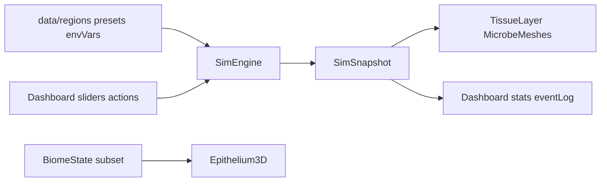

# Data Model

Type definitions and state contracts for the Bio-Dynamics simulation and configuration layers.

Sources: [`src/sim/types.ts`](../src/sim/types.ts), [`src/data/regions.ts`](../src/data/regions.ts), [`src/data/envVars.ts`](../src/data/envVars.ts), [`src/data/presets.ts`](../src/data/presets.ts), [`src/scene/epithelium/types.ts`](../src/scene/epithelium/types.ts)

---

## Simulation types

### `MicrobeType`

```typescript
'probiotic' | 'commensal' | 'pathogen' | 'allergen' | 'yeast' | 'prebiotic' | 'postbiotic'
```

Note: `postbiotic` exists in the type union but postbiotics are modeled as a scalar, not nodes.

### `MicrobeNode`

Individual microbe agent in the simulation.

| Field | Type | Description |
| --- | --- | --- |
| `id` | number | Unique incrementing ID |
| `type` | MicrobeType | Category |
| `strain` | string | Display/effect label (e.g. "L. rhamnosus", "inulin") |
| `vitality` | number | 0–1 life force; growth/decay per tick |
| `x`, `y`, `z` | number | Position in simulation space |
| `vx`, `vy` | number | Velocity components |

Nodes with vitality ≤ 0.05 are removed each tick.

### `BiomeState`

Tissue environment and aggregate metrics.

| Field | Type | Range | Controlled by |
| --- | --- | --- | --- |
| `ph` | number | 4–8 typical | Slider + triggers/inoculations |
| `moisture` | number | 0–1 | Slider + triggers + scalp drift |
| `temperature` | number | 0–1 | Slider |
| `sebum` | number | 0–1 | Slider + triggers |
| `cerumen` | number | 0–1 | Slider + triggers |
| `salinity` | number | 0–1 | Slider + triggers |
| `oxygenation` | number | 0–1 | Slider + ear drift |
| `sweatRate` | number | 0–1 | Slider |
| `oxygenTension` | number | 0–1 | Slider |
| `integrity` | number | 0–1 | Dynamics + actions |
| `inflammation` | number | 0–1 | Dynamics + actions |
| `biofilm` | number | 0–1 | Dynamics + actions |
| `sugarLoad` | number | 0–1 | Triggers + decay |
| `probioticCount` | number | ≥ 0 | Computed from nodes |
| `pathogenCount` | number | ≥ 0 | pathogen + yeast nodes |
| `allergenCount` | number | ≥ 0 | Computed |
| `commensalCount` | number | ≥ 0 | Computed |
| `postbioticLevel` | number | 0–1 | Conversion + scfa action |

### `SimSnapshot`

Frame output passed to scene and dashboard.

| Field | Type | Description |
| --- | --- | --- |
| `tick` | number | Current simulation tick |
| `biome` | BiomeState | Copy of biome state |
| `nodes` | MicrobeNode[] | Copy of all live nodes |
| `events` | string[] | Last 8 event log messages |

---

## Configuration types

### `RegionId`

```typescript
'ear' | 'scalp' | 'nose' | 'oral' | 'skin' | 'vaginal' | 'gut'
```

### `RegionBaseline`

Initial population and tissue state at region reset.

| Field | Type | Description |
| --- | --- | --- |
| `commensals` | number | Generic commensal spawn count |
| `probiotics` | `{ strain, count }[]` | Probiotic strains to seed |
| `pathogens` | `{ strain, count, kind }[]` | Optional pathogen/yeast seeds |
| `prebiotics` | `{ strain, count }[]` | Optional prebiotic seeds |
| `integrity` | number? | Override default 0.85 |
| `inflammation` | number? | Override default 0.10 |
| `biofilm` | number? | Override default 0.05 |

### `RegionAction` / `RegionInoculation`

| Field | Type | Description |
| --- | --- | --- |
| `id` | string | Engine action ID |
| `label` | string | Dashboard button text |
| `strain` | string | Inoculation only — display label |

### `RegionDef`

Full region configuration.

| Field | Type | Description |
| --- | --- | --- |
| `id` | RegionId | Region identifier |
| `label` | string | Display name |
| `active` | boolean | Whether selectable (all true) |
| `hotspot` | [x, y, z] | Body mesh click target |
| `microGeometry` | EpitheliumKind | 3D tissue model key |
| `zoomTitle` | string | Micro view HUD title |
| `scaleLabel` | string | Magnification label |
| `defaultStrains` | object | Label strings for legend |
| `env` | RegionEnv | Default environment values |
| `baseline` | RegionBaseline | Initial microbes and tissue |
| `triggers` | RegionAction[] | Available stressors |
| `inoculations` | RegionInoculation[] | Available interventions |

### `PresetId`

```typescript
'allergy' | 'candida' | 'lifecycle'
```

### `PresetDef`

| Field | Type | Description |
| --- | --- | --- |
| `id` | PresetId | Preset identifier |
| `title` | string | Display title |
| `scenario` | string | Dashboard description |
| `scenarioLifestage` | string? | Alternate text for `context=lifestage` |
| `articleKey` | keyof ARTICLES | Blog link key |
| `defaultRegion` | RegionId | Region on preset load |
| `env` | RegionEnv | Env overrides applied on preset init |

### `EnvVarId` / `EnvVarDef` / `RegionEnv`

```typescript
type EnvVarId = 'ph' | 'moisture' | 'temperature' | 'sebum' | 'cerumen'
  | 'salinity' | 'oxygenation' | 'sweatRate' | 'oxygenTension';

type RegionEnv = Record<EnvVarId, number>;
```

`EnvVarDef` includes min, max, step, default, label, and format function.

### `ProductId` / `ProductDef`

Catalog of whole supplements, topical treatments, and fermented foods. Source: [`products.ts`](../src/data/products.ts).

```typescript
type ProductId =
  | 'synbiotic_supplement' | 'oral_probiotic_lozenge' | 'vaginal_probiotic_capsule'
  | 'probiotic_topical_cream' | 'kefir_drink' | 'probiotic_yogurt' | 'kimchi'
  | 'sauerkraut' | 'kombucha' | 'miso';

type ProductCategory = 'supplement' | 'lozenge' | 'fermented' | 'topical';
type ProductForm = 'capsule' | 'lozenge' | 'drink' | 'food' | 'topical';
```

| Field | Type | Description |
| --- | --- | --- |
| `id` | ProductId | Engine action ID |
| `label` | string | Dashboard button text |
| `category` | ProductCategory | UI styling group |
| `form` | ProductForm | Delivery form label |
| `strains` | `{ id: StrainId, dose: number }[]` | Probiotic doses (scaled by region multiplier) |
| `prebiotics` | `{ id: PrebioticId, dose: number }[]`? | Optional prebiotic doses |
| `effects` | BiomeEffect? | Product-level biome bonus |
| `preferredRegions` | RegionId[] | Full-efficacy tissues |
| `preferredMultiplier` | number | Typically 1 |
| `otherMultiplier` | number | Reduced efficacy elsewhere |

### `PostbioticId` / `PostbioticDef`

Direct SCFA metabolite applications. Source: [`postbiotics.ts`](../src/data/postbiotics.ts).

```typescript
type PostbioticId = 'scfa_mix' | 'butyrate' | 'propionate' | 'acetate';
```

Postbiotics modify `postbioticLevel` and related biome scalars — they do **not** spawn microbe nodes.

### `RegionSuggestions`

Per-region curated shortcuts for the **Suggested for [tissue]** chips. Source: [`regionSuggestions.ts`](../src/data/regionSuggestions.ts).

```typescript
interface RegionSuggestions {
  strains?: StrainId[];
  prebiotics?: PrebioticId[];
  postbiotics?: PostbioticId[];
  products?: ProductId[];
}
```

---

## Visualization types

### `EpitheliumKind`

```typescript
'sinus' | 'skin' | 'gut' | 'ear' | 'scalp' | 'oral' | 'vaginal'
```

Maps region `microGeometry` to tissue model builder.

### `EpitheliumState`

Subset of biome passed to 3D tissue renderer.

| Field | Used for |
| --- | --- |
| `inflammation` | Emissive redness on inflamed meshes |
| `integrity` | Overlay opacity |
| `biofilm` | Biofilm overlay visibility |
| `postbioticLevel` | Healing glow tint |
| `ph`, `moisture`, `sebum`, `cerumen`, `sweatRate` | Layer-specific visual tweaks |

---

## Internal engine state (not in snapshot)

| Field | Type | Description |
| --- | --- | --- |
| `allergenAdhesion` | number | 0–1; affects allergen fall speed |
| `prevCounts` | object | Previous tick population counts |
| `trends` | object | −1/0/+1 deltas for dashboard |
| `rand` | function | Seeded PRNG |

---

## Data flow



1. **Init:** region config seeds nodes and biome
2. **Each frame:** user input → engine mutations; `step(dt)` → snapshot
3. **Scene:** maps snapshot nodes to instanced meshes; biome subset to tissue overlays
4. **Dashboard:** formats biome counts × POPULATION_SCALE; shows events

---

## Related docs

- [Model overview](model-overview.md)
- [Simulation dynamics](dynamics.md)
- [System overview](../architecture/system-overview.md)
