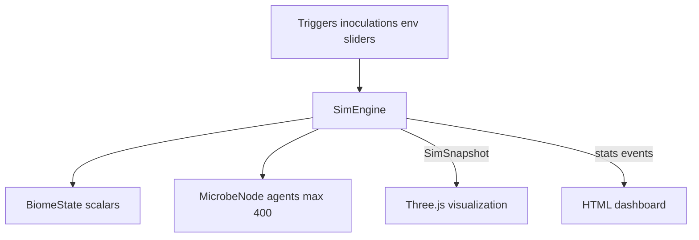

# Simulation Model Overview

Design of the deterministic microbiome simulation engine in Bio-Dynamics.

Source: [`src/sim/engine.ts`](../src/sim/engine.ts)

---

## Design philosophy

Bio-Dynamics uses a **deterministic tick-based agent model**:

- Individual microbes are `MicrobeNode` agents with vitality and 2D-ish positions
- Tissue state is a set of scalar `BiomeState` fields
- User actions apply **immediate** biome mutations and spawns
- Continuous dynamics run each simulation tick

This is **not**:

- A differential-equation ODE model
- A formal agent-based modeling framework
- A spatially accurate microbiology simulation

It is an **educational abstraction** tuned for visual feedback and reproducible demos.

---

## Architecture



---

## Constants

| Constant | Value | Purpose |
| --- | --- | --- |
| `FIXED_DT` | 1/30 s | Simulation tick duration (30 Hz) |
| Max substeps/frame | 4 | Caps work per render frame |
| `MAX_NODES` | 400 | Maximum live microbe agents |
| PRNG seed | 42 (default) | Reproducible spawn positions/vitality |
| `POPULATION_SCALE` | 1000 | UI display multiplier for counts |
| Probiotic suppression | strain-specific (default radius 0.35, strength 0.006) | `StrainDef.competition` in `strains.ts` |
| Prebiotic conversion radius | 0.4 | Distance to probiotic for SCFA conversion |
| Vitality prune threshold | 0.05 | Nodes at or below removed |

---

## Engine lifecycle

### Construction

```text
new SimEngine(preset, region, seed?)
  → setRegion(region)
    → reset()
      → seedFromRegion()
```

### Region change

`setRegion(id)` resets tick, nodes, events, and re-seeds from region baseline.

### Preset change

`setPreset(preset, env?)` updates preset ID, resets simulation, optionally applies env overrides.

### Frame step

```text
step(dt)
  → substeps = min(4, ceil(dt / FIXED_DT))
  → for each substep: tick++; simulateTick()
  → updateTrends()
  → return snapshot()
```

Maximum simulation rate: ~120 ticks/s (4 substeps at 60 FPS). Typical: 30–60 ticks/s.

### Snapshot

`snapshot()` returns immutable copy:

- `tick` — current tick count
- `biome` — shallow copy of `BiomeState`
- `nodes` — shallow copy of all `MicrobeNode` objects
- `events` — last 8 event strings

---

## Action model

### Triggers and inoculations

`trigger(id)` and `inoculate(actionId)`:

1. Check `isActionAllowed()` against region config
2. Apply immediate biome mutations and/or spawn batches (`immuneActivity`, pH, integrity, etc.)
3. Push event log messages
4. Call `syncEmergentInflammation()` — recalculates **`inflammation`** (and **`tryptophanSupport`** on gut) toward emergent targets

No cooldowns or action queues.

### Environment changes

`setEnv(partial)` writes slider values directly into `biome`. Takes effect immediately and influences subsequent tick dynamics.

---

## Spawning

`spawnBatch(type, strain, count, opts?)`:

- Respects `MAX_NODES` cap
- Initial vitality: 0.7 + random × 0.3
- **Epithelial types** (commensal, pathogen, yeast, probiotic): y ∈ [−0.55, 0.10]
- **Allergens** (`fromAbove: true`): y ∈ [0.55, 1.25], downward velocity
- **Prebiotics:** random y in [−0.55, 0.10] range (non-epithelial branch)
- x ∈ [−1.7, 1.7], z ∈ [−0.7, 0.7] approximately

---

## Determinism

Randomness uses a **linear congruential generator** (LCG):

```typescript
s = (s * 16807 + 0) % 2147483647
return (s - 1) / 2147483646
```

Same seed + same action sequence → same spawn positions and initial vitals. Tick dynamics are deterministic given initial state.

Floating-point order may vary across browsers but is stable within a single session.

---

## Region gating

```typescript
isActionAllowed(actionId, kind: 'trigger' | 'inoculation')
```

Compares action ID against `region.triggers` or `region.inoculations` from [`regions.ts`](../data/regions.ts).

---

## Trend tracking

After each `step()`, population counts are compared to previous tick:

- `getTrends()` returns `{ probiotic, pathogen, allergen, commensal }` as −1, 0, or +1
- Dashboard displays ↑ / ↓ / → labels

---

## Related docs

- [Simulation dynamics](dynamics.md)
- [Data model](data-model.md)
- [Actions reference](../domain/actions-reference.md)
- [Assumptions and limits](assumptions-and-limits.md)
